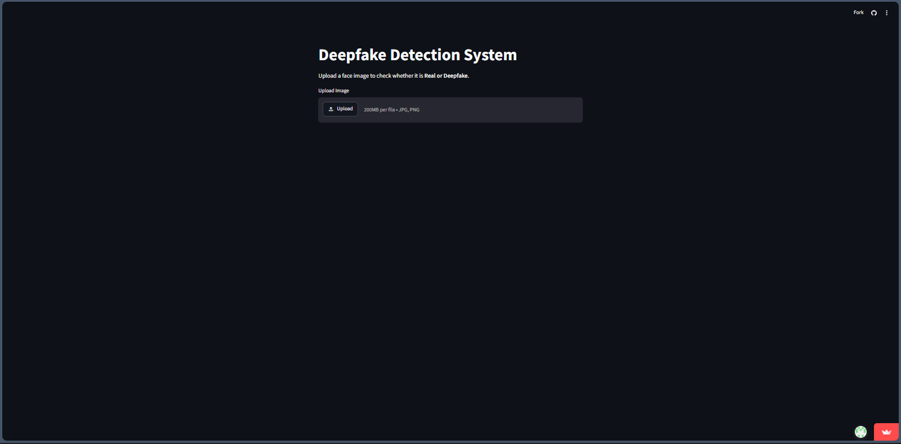
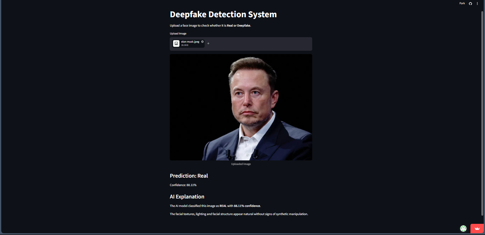
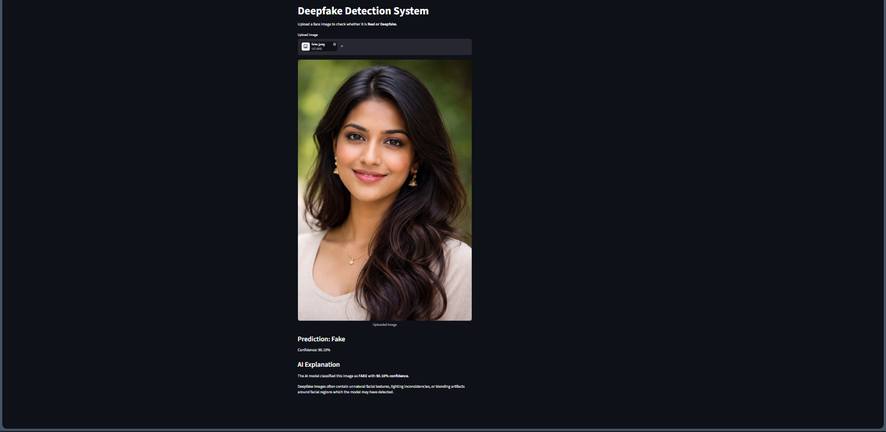
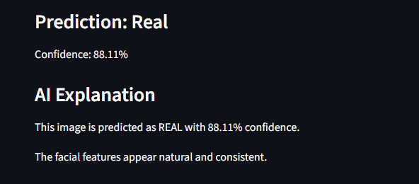

# Deepfake Detection

A ResNet18-based binary image classifier that predicts whether a face image is **real** or **AI-generated (fake)**, with a confidence score, a human-readable explanation, and an interactive Streamlit demo.


---

## Table of Contents

- [Overview](#overview)
- [Project Structure](#project-structure)
- [Model Architecture](#model-architecture)
- [Dataset](#dataset)
- [Installation](#installation)
- [Training](#training)
- [Evaluation](#evaluation)
- [Inference (CLI)](#inference-cli)
- [Streamlit App](#streamlit-app)
- [Screenshots](#screenshots)
- [Future Improvements](#future-improvements)
- [Contributing](#contributing)
- [License](#license)

---

## Overview

This project detects deepfake face images using transfer learning on a ResNet18 backbone. Given an input image, it outputs:

- A **prediction**: `Real` or `Fake`
- A **confidence score** (softmax probability of the predicted class)
- A short **natural-language explanation** of the result

The codebase started as a Google Colab research notebook and has been refactored here into a modular, testable, production-style repository — the model, training configuration, preprocessing, and prediction logic are unchanged from the final validated notebook run.

## Project Structure

```
deepfake-detection/
├── app.py                    # Root Streamlit entrypoint (streamlit run app.py)
├── train.py                  # Training CLI
├── predict.py                 # Single-image prediction CLI
├── evaluate.py                 # Checkpoint evaluation CLI
├── config.py                  # Centralized paths, hyperparameters, constants
├── requirements.txt
├── README.md
├── .gitignore
├── LICENSE
│
├── models/
│   ├── model.py               # ResNet18 architecture definition
│   ├── trainer.py              # Training / evaluation loop
│   └── inference.py             # Single-image prediction logic
│
├── data/
│   ├── dataset.py              # ImageFolder + DataLoader construction
│   └── transforms.py             # Image preprocessing pipelines
│
├── utils/
│   ├── helpers.py               # Device selection, seeding, checkpoint I/O
│   ├── metrics.py               # Accuracy / confusion matrix helpers
│   ├── logger.py                # Project-wide logging setup
│   └── visualization.py            # Training curve / confusion matrix plots
│
├── explainability/
│   ├── explanation.py             # Rule-based explanation (used by the app)
│   └── llm_explanation.py           # Optional Gemini-based explanation
│
├── streamlit_app/
│   └── app.py                   # Streamlit UI implementation
│
├── checkpoints/                  # Trained model weights (gitignored)
└── notebooks/                    # Original research notebook (reference only)
```

## Model Architecture

- **Backbone:** `torchvision.models.resnet18` initialized with `IMAGENET1K_V1` weights
- **Head:** the final fully connected layer is replaced with a single `nn.Linear(in_features, 2)` binary classification layer
- **Loss:** `CrossEntropyLoss`
- **Optimizer:** `Adam`, learning rate `1e-4`
- **Batch size:** 32
- **Epochs:** 5
- **Preprocessing:** `Resize(224, 224)` → `ToTensor()` (no normalization — the shipped checkpoint was trained this way, so inference must match exactly)

Earlier notebook experiments tried frozen backbones with deeper `Sequential` heads and partial layer unfreezing; those were exploratory and are not part of the shipped model. See `notebooks/` for the full experimental history.

## Dataset

Training used the [`manjilkarki/deepfake-and-real-images`](https://www.kaggle.com/datasets/manjilkarki/deepfake-and-real-images) Kaggle dataset, organized as:

```
data_root/
├── Train/
│   ├── Fake/
│   └── Real/
└── Validation/
    ├── Fake/
    └── Real/
```

Set the `DEEPFAKE_DATA_DIR` environment variable to point at your local copy, or place it at `./data_root` by default.

To download it yourself via the Kaggle API:

```bash
export KAGGLE_USERNAME=your_username
export KAGGLE_KEY=your_key
kaggle datasets download manjilkarki/deepfake-and-real-images
unzip deepfake-and-real-images.zip -d data_root
```

> **Security note:** Never commit your `kaggle.json` or hardcode API keys in source files. This repo reads all credentials from environment variables.

## Installation

```bash
git clone https://github.com/<your-username>/deepfake-detection.git
cd deepfake-detection

python -m venv .venv
source .venv/bin/activate   # Windows: .venv\Scripts\activate

pip install -r requirements.txt
```

## Training

```bash
python train.py --train-dir data_root/Train --val-dir data_root/Validation
```

Optional flags: `--epochs`, `--batch-size`, `--lr`, `--checkpoint-path`. Defaults match the original production run (5 epochs, batch size 32, lr 1e-4) and the model is saved to `checkpoints/resnet18_deepfake.pth`.

## Evaluation

```bash
python evaluate.py --data-dir data_root/Validation --checkpoint-path checkpoints/resnet18_deepfake.pth
```

Prints accuracy and saves a confusion matrix image to `checkpoints/confusion_matrix.png`.

## Inference (CLI)

```bash
python predict.py --image path/to/image.jpg
python predict.py --image path/to/image.jpg --detailed   # tiered risk-level explanation
```

## Streamlit App

```bash
streamlit run app.py
```

Upload a JPG/PNG/JPEG image and the app will display the prediction, confidence, and explanation in your browser.

## Screenshots

### Home Page



---

### Real Image Prediction



---

### AI Generated Image Prediction



---

### AI Explanation



<!-- Add screenshots of the Streamlit app here, e.g.: -->
<!--  -->

## Future Improvements

- Add automated tests (`pytest`) for the data pipeline, model, and inference logic
- Add a proper held-out test split separate from validation
- Explore stronger backbones (EfficientNet, ViT) as a separate experiment track
- Add Grad-CAM–style visual explanations alongside the text explanation
- Containerize with Docker for reproducible deployment
- Add CI (GitHub Actions) for linting and tests on every PR

## Contributing

Contributions are welcome. Please:

1. Fork the repo and create a feature branch
2. Follow PEP 8 and keep functions type-hinted and docstringed
3. Open a pull request describing the change and why it's needed

## License

This project is licensed under the MIT License — see [LICENSE](LICENSE) for details.
